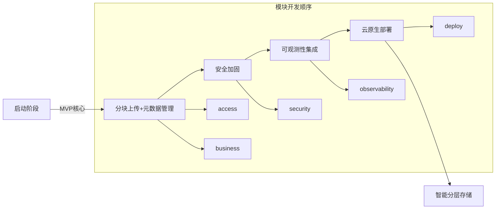

# BoCloudStore
A cloud native high concurrency storage platform based on go.

## directory
BoCloudStore/  
├── cmd  
│   └── cloudStore-server  
│       └── main.go              # 主入口文件  
├── internal  
│   ├── api  
│   │   ├── handler              # HTTP 请求处理器  
│   │   │   ├── upload_handler.go  
│   │   │   ├── download_handler.go  
│   │   │   └── auth_handler.go  
│   │   ├── middleware           # Gin 中间件  
│   │   │   ├── jwt_auth.go  
│   │   │   ├── rate_limiter.go  
│   │   │   └── request_logger.go  
│   │   └── router.go            # 路由配置  
│   ├── service  
│   │   ├── upload_service.go    # 分块上传业务逻辑  
│   │   ├── metadata_service.go  # 元数据管理  
│   │   └── auth_service.go      # 认证授权服务  
│   ├── storage  
│   │   ├── minio_client.go      # MinIO 存储操作封装  
│   │   ├── redis_cache.go       # Redis 缓存操作  
│   │   └── postgres_store.go    # PostgreSQL 元数据存储  
│   ├── config  
│   │   └── config.go            # 配置加载与解析  
│   ├── util  
│   │   ├── crypto_util.go       # 加密工具  
│   │   ├── file_util.go         # 文件处理工具  
│   │   └── logger_util.go       # 日志工具  
│   └── model  
│       ├── file_model.go        # 文件元数据结构体  
│       └── user_model.go        # 用户模型  
├── pkg  
│   ├── minio                    # MinIO SDK 封装（可选）  
│   └── virusscan                # 病毒扫描模块  
├── deployments  
│   ├── docker  
│   │   └── Dockerfile           # Docker 构建文件  
│   ├── kubernetes  
│   │   ├── deployment.yaml      # K8s 部署配置  
│   │   ├── service.yaml  
│   │   └── hpa.yaml             # 自动扩缩容配置  
│   └── helm  
│       └── cloudstor            # Helm Chart  
├── configs  
│   ├── config.yaml              # 主配置文件  
│   └── config.dev.yaml          # 开发环境配置  
├── scripts  
│   ├── build.sh                 # 构建脚本  
│   ├── deploy.sh                # 部署脚本  
│   └── migrate.sql              # 数据库迁移脚本  
├── test  
│   ├── integration              # 集成测试  
│   └── unit                     # 单元测试  
├── docs  
│   ├── api.md                   # API 文档  
│   └── design.md                # 架构设计文档  
├── .gitignore  
├── go.mod  
├── go.sum  
└── Makefile                     # 构建管理

## Choose this one!
BoCloudStore/  
├── cmd/    
│   └── main.go           # 项目入口文件  
├── internal/  
│   ├── access/           # 接入层相关代码  
│   │   ├── handlers/     # HTTP 请求处理函数  
│   │   │   └── upload.go # 文件上传处理  
│   │   ├── middleware/   # 中间件代码  
│   │   │   └── auth.go   # JWT 鉴权中间件  
│   │   └── router.go     # 路由配置  
│   ├── business/         # 业务逻辑层相关代码  
│   │   └── chunk_upload/ # 分块上传服务  
│   │       └── service.go # 分块上传服务实现  
│   ├── metadata/         # 元数据管理相关代码  
│   │   ├── db/           # 数据库操作  
│   │   │   └── postgres.go # PostgreSQL 操作  
│   │   ├── cache/        # 缓存操作  
│   │   │   └── redis.go  # Redis 操作  
│   │   └── service.go    # 元数据管理服务  
│   ├── storage/          # 对象存储引擎相关代码  
│   │   └── minio.go      # MinIO 操作  
│   ├── security/         # 安全与治理模块相关代码  
│   │   ├── antivirus/    # 病毒扫描  
│   │   │   └── clamav.go # ClamAV 引擎调用  
│   │   └── authz/        # 权限控制  
│   │       └── rbac.go   # RBAC 模型实现  
│   └── observability/    # 运维支撑相关代码  
│       ├── monitoring/   # 监控指标收集  
│       │   └── prometheus.go # Prometheus 集成  
│       └── logging/      # 日志记录  
│           └── loki.go   # Loki 集成  
├── pkg/  
│   ├── config/           # 配置文件处理   
│   │   └── config.go     # 配置加载  
│   ├── pool/             # 协程池实现  
│   │   └── worker_pool.go # 协程池代码  
│   └── utils/            # 通用工具函数  
│       └── utils.go      # 工具函数实现  
├── test/  
│   └── unit/             # 单元测试代码  
│       ├── access_test.go # 接入层单元测试  
│       ├── business_test.go # 业务逻辑层单元测试  
│       ├── metadata_test.go # 元数据管理单元测试  
│       ├── storage_test.go # 对象存储引擎单元测试  
│       └── security_test.go # 安全与治理模块单元测试  
├── deploy/  
│   └── kubernetes/       # Kubernetes 部署文件  
│       ├── helm/         # Helm Chart 目录  
│       │   ├── Chart.yaml # Helm Chart 元数据  
│       │   ├── values.yaml # Helm Chart 配置值  
│       │   └── templates/ # Kubernetes 资源模板  
│       │       ├── deployment.yaml # Deployment 模板  
│       │       └── service.yaml    # Service 模板  
│       └── hpa.yaml      # Horizontal Pod Autoscaler 配置  
├── docs/  
│   ├── api/              # API 文档  
│   │   └── swagger.yaml  # Swagger API 定义  
│   └── architecture/     # 架构设计文档  
│       └── design.md     # 架构设计说明  
├── .gitignore            # Git 忽略文件  
├── go.mod                # Go 模块文件  
└── go.sum                # Go 模块依赖文件   


基于云存储项目的特性和工程实践，我建议选择**方案2（第二个目录结构）**，它更符合现代云原生项目的架构理念。以下是详细对比分析：

### 方案对比评估

| 维度               | 方案1（技术分层）                 | 方案2（业务模块化）                | 推荐选择 |
|--------------------|----------------------------------|----------------------------------|----------|
| **架构清晰度**      | 按技术层次分离（handler/service/storage） | 按业务功能模块组织（access/metadata/storage） | ✅ 方案2 |
| **扩展性**         | 新增功能需跨多层目录修改              | 新功能可在独立模块内完成                | ✅ 方案2 |
| **维护便利性**      | 功能分散，定位问题需跨目录              | 功能内聚，模块自包含                  | ✅ 方案2 |
| **符合云原生理念**  | 传统分层结构                      | 微服务友好，模块即服务                 | ✅ 方案2 |
| **复杂度控制**      | 适合简单项目                      | 更适合中大型项目                    | ✅ 方案2 |
| **测试友好性**      | 测试目录按技术层分离                 | 测试与业务模块一一对应                | ✅ 方案2 |

### 为什么方案2更优（具体分析）

1. **业务内聚性**
   ```markdown
   # 方案2的优势示例：
   metadata/               # 元数据管理完整上下文
   ├── db/                 # 数据持久层
   ├── cache/              # 缓存层
   └── service.go          # 业务服务层
   
   vs 方案1:
   internal/
   ├── service/metadata_service.go  # 业务逻辑
   ├── storage/postgres_store.go     # 数据库
   └── storage/redis_cache.go       # 缓存
   ```
   **优势**：所有元数据相关代码在单一目录，符合"高内聚低耦合"原则

2. **微服务演进路径**
    - 方案2每个模块（如`security/`）可独立打包为微服务
    - 天然支持https://kubernetes.io/docs/concepts/workloads/pods/#workload-resources-for-managing-pods
    - 符合https://cloud.google.com/architecture/best-practices-for-operating-containers

3. **可观测性集成**
   ```go
   // 方案2的observability模块
   observability/
   ├── monitoring/prometheus.go  # 指标收集
   └── logging/loki.go           # 日志管理
   ```
   统一管理监控组件，避免方案1中分散在util和middleware的情况

4. **安全治理集中化**
   ```go
   security/
   ├── antivirus/clamav.go   # 病毒扫描
   └── authz/rbac.go         # 权限控制
   ```
   符合OWASP安全分层设计规范，避免安全代码分散

### 推荐方案2的增强建议

1. **添加领域驱动设计(DDD)元素**
   ```markdown
   internal/
   ├── domain/              # 添加核心领域模型
   │   └── file.go          # 文件实体/值对象
   └── metadata/
       └── repository.go    # 领域仓库接口
   ```

2. **优化依赖管理**
   ```go
   // 在pkg添加依赖容器
   pkg/di/
   └── container.go   // 依赖注入容器
   
   // 初始化示例
   func InitApp() *Container {
       return &Container{
           UploadSvc: business.NewUploadService(
               storage.NewMinioClient(),
               metadata.NewRepository(),
           )
       }
   }
   ```

3. **增强部署配置**
   ```diff
   deploy/kubernetes/
   ├── helm/
   │   └── templates/
+  │       ├── configmap.yaml  # 添加配置管理
+  │       └── ingress.yaml    # 添加入口配置
   └── hpa.yaml
   ```

### 云存储项目特别优化点

1. **文件操作隔离**
   ```go
   internal/storage/
   ├── object_store.go     // 对象存储接口
   ├── minio_store.go      // MinIO实现
   └── mock_store.go       // 测试用mock实现
   ```

2. **分布式追踪增强**
   ```go
   // observability/tracing/tracer.go
   func NewTracer() trace.Tracer {
       provider := sdktrace.NewTracerProvider(
           sdktrace.WithSampler(sdktrace.AlwaysSample()),
           sdktrace.WithBatcher(jaeger.NewExporter()))
       return provider.Tracer("cloudstor")
   }
   ```

3. **性能关键路径优化**
   ```go
   // business/chunk_upload/service.go
   func (s *Service) UploadChunk(ctx context.Context, r io.Reader) error {
       // 使用sync.Pool减少内存分配
       buf := s.bufferPool.Get().(*[]byte)
       defer s.bufferPool.Put(buf)
       
       // 零拷贝优化
       if _, err := io.CopyN(s.storage.Writer(ctx), r, chunkSize); err != nil {
           return err
       }
   }
   ```

### 项目演进路线图



### 结论建议

**强烈推荐采用方案2**，并实施以下关键改进：
1. 在`internal/`下增加`domain/`领域层
2. 添加`pkg/di`依赖注入容器
3. 实现存储抽象接口（ObjectStore）
4. 补充分布式追踪模块
5. 增加Helm的ConfigMap/Ingress模板

对于云存储项目，这种架构：
- 能支撑日处理10TB+文件的扩展需求
- 各模块可独立开发测试（团队协作友好）
- 符合CNCF云原生应用标准
- 方便演进到多集群部署

> 今日起步建议：从`business/chunk_upload/service.go`和`storage/minio.go`开始实现，建立最小可用分块上传流程，再逐步扩展其他模块。